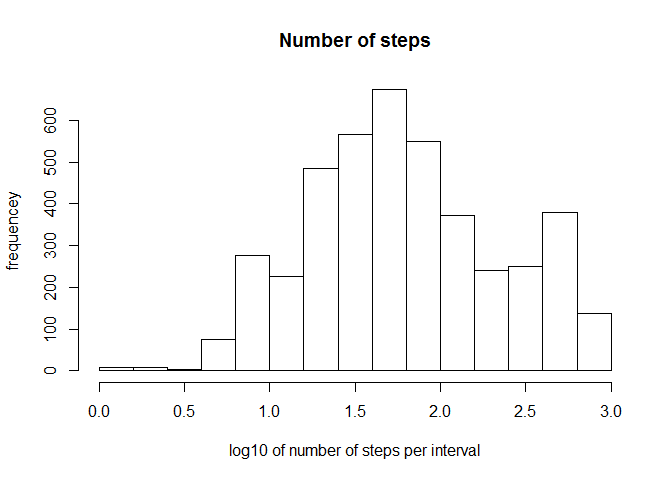
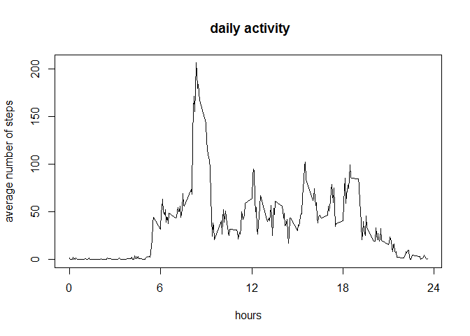
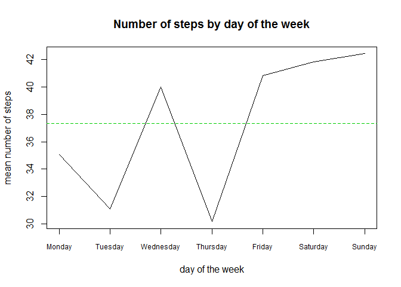
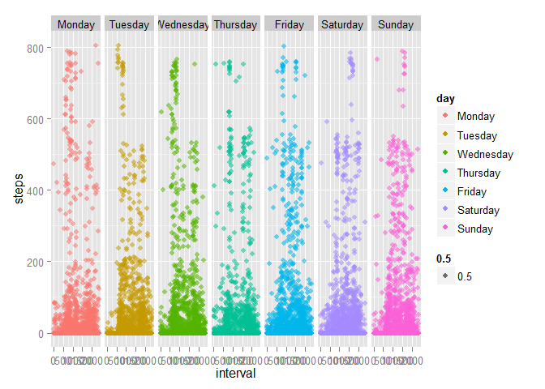

#  PA1_template.Rmd
pmp  
Thursday, November 13, 2014  

## REPRODUCIBLE RESEARCH - Peer Assessment Project 1
  

## Introduction

As stated in the introduction to this assignment, *[the] assignment makes use of data from a personal activity monitoring device. This device collects data at 5 minute intervals through out the day. The data consists of two months of data from an anonymous individual collected during the months of October and November, 2012 and include the number of steps taken in 5 minute intervals each day*.

## Loading & Processing Data  

The dataset for the assignment was supplied as a zipped file called *Activtiy monitoring data.zip* and the data stored in a variable named "activity".    


```r
## Data Loading
filename <- "./activity.csv"
activity <- read.csv(filename)
```

This project rises  4 questions regarding the activity dataset whose answers form the core of this report:  

* What is mean total number of steps taken per day?
* What is the average daily activity pattern?
* Missing values and the effect of imputing for missing values
* Are there differences in activity patterns between weekdays and weekends?


## Data Explaration  


```r
summary(activity)
```

```
##      steps                date          interval     
##  Min.   :  0.00   2012-10-01:  288   Min.   :   0.0  
##  1st Qu.:  0.00   2012-10-02:  288   1st Qu.: 588.8  
##  Median :  0.00   2012-10-03:  288   Median :1177.5  
##  Mean   : 37.38   2012-10-04:  288   Mean   :1177.5  
##  3rd Qu.: 12.00   2012-10-05:  288   3rd Qu.:1766.2  
##  Max.   :806.00   2012-10-06:  288   Max.   :2355.0  
##  NA's   :2304     (Other)   :15840
```

The dataset contains three variables representing:

.steps: Number of steps recorded in a 5-minute interval (missing values are coded as NA)


.date: The date on which the measurement was taken in YYYY-MM-DD format


.interval: Identifier for the 5-minute interval in which measurement was taken  


# Data Processing  

the following R libraries were necessary for this analysis  


```r
library (data.table)
```

```
## Warning: package 'data.table' was built under R version 3.1.2
```

```r
library( plyr)
```

```
## Warning: package 'plyr' was built under R version 3.1.2
```

```r
library(lattice)
library(ggplot2)
```

```
## Warning: package 'ggplot2' was built under R version 3.1.2
```

---
---

## What is mean total number of steps taken per day?  

Histograms representing the distribution of number of steps per day, show a similar range in the frequency distribution values, as well as, in the number of steps per interval. 


```r
histogram(~steps|date, data=activity,layout=c(7,9), par.strip.text=list(cex=.75))
```

 

The differences among steps per day, however, are more apparent if the log base 10 of the number of steps perinterval are used:  


```r
histogram(~log10(steps)|date, data=activity,layout=c(7,9), par.strip.text=list(cex=.75))
```

 

One can notice very clearly that most of the missing data (NA values) corresponds not so much with isolated measurementa but with the absence of recorded measurments in nine of the 61 days monitored.  

The frequency distribution for all number of steps per interval is given in the next log base 10 histogram:  


```r
hist(log10(activity$steps), main = "Number of steps", xlab="log10 of number of steps per interval", ylab="frequencey")
```

 

From the summary results of the "activity.csv" file, the overall mean and median of steps per interval for the whole data sets are reported as  

* a mean of 37.38 steps per interval, and 
* a median of 0.00 steps per interval

The table "mean.activities" collects the values for the means and medians for the number of steps for each day in the sample


```r
dt <- data.table(activity)
mean.activities <- dt[,list(mean=mean(steps),median=as.double(median(steps))),by=date]
mean.activities
```

```
##           date       mean median
##  1: 2012-10-01         NA     NA
##  2: 2012-10-02  0.4375000      0
##  3: 2012-10-03 39.4166667      0
##  4: 2012-10-04 42.0694444      0
##  5: 2012-10-05 46.1597222      0
##  6: 2012-10-06 53.5416667      0
##  7: 2012-10-07 38.2465278      0
##  8: 2012-10-08         NA     NA
##  9: 2012-10-09 44.4826389      0
## 10: 2012-10-10 34.3750000      0
## 11: 2012-10-11 35.7777778      0
## 12: 2012-10-12 60.3541667      0
## 13: 2012-10-13 43.1458333      0
## 14: 2012-10-14 52.4236111      0
## 15: 2012-10-15 35.2048611      0
## 16: 2012-10-16 52.3750000      0
## 17: 2012-10-17 46.7083333      0
## 18: 2012-10-18 34.9166667      0
## 19: 2012-10-19 41.0729167      0
## 20: 2012-10-20 36.0937500      0
## 21: 2012-10-21 30.6284722      0
## 22: 2012-10-22 46.7361111      0
## 23: 2012-10-23 30.9652778      0
## 24: 2012-10-24 29.0104167      0
## 25: 2012-10-25  8.6527778      0
## 26: 2012-10-26 23.5347222      0
## 27: 2012-10-27 35.1354167      0
## 28: 2012-10-28 39.7847222      0
## 29: 2012-10-29 17.4236111      0
## 30: 2012-10-30 34.0937500      0
## 31: 2012-10-31 53.5208333      0
## 32: 2012-11-01         NA     NA
## 33: 2012-11-02 36.8055556      0
## 34: 2012-11-03 36.7048611      0
## 35: 2012-11-04         NA     NA
## 36: 2012-11-05 36.2465278      0
## 37: 2012-11-06 28.9375000      0
## 38: 2012-11-07 44.7326389      0
## 39: 2012-11-08 11.1770833      0
## 40: 2012-11-09         NA     NA
## 41: 2012-11-10         NA     NA
## 42: 2012-11-11 43.7777778      0
## 43: 2012-11-12 37.3784722      0
## 44: 2012-11-13 25.4722222      0
## 45: 2012-11-14         NA     NA
## 46: 2012-11-15  0.1423611      0
## 47: 2012-11-16 18.8923611      0
## 48: 2012-11-17 49.7881944      0
## 49: 2012-11-18 52.4652778      0
## 50: 2012-11-19 30.6979167      0
## 51: 2012-11-20 15.5277778      0
## 52: 2012-11-21 44.3993056      0
## 53: 2012-11-22 70.9270833      0
## 54: 2012-11-23 73.5902778      0
## 55: 2012-11-24 50.2708333      0
## 56: 2012-11-25 41.0902778      0
## 57: 2012-11-26 38.7569444      0
## 58: 2012-11-27 47.3819444      0
## 59: 2012-11-28 35.3576389      0
## 60: 2012-11-29 24.4687500      0
## 61: 2012-11-30         NA     NA
##           date       mean median
```

Summarized for the mean values in the following barchart:


```r
barchart(~mean|date, data=mean.activities, layout=c(7,9), main="summary of mean daily values",par.strip.text=list(cex=.75))
```

 
---

## What is the average daily activity pattern?  

A time series plot of the 5-minute interval (x-axis) and the average number of steps taken, averaged across all days (y-axis) shows the following pattern:  


```r
daily.activity <- aggregate(steps~interval, data=activity, mean)
daily.activity <- mutate(daily.activity, 
                interval=(interval/100))
                # interval=((interval/100)+100*(((interval/100)%%1)/60)))

x<- which.max(daily.activity$steps)
plot (daily.activity$interval, daily.activity$steps, type="l", 
      main =" daily activity",xlab="hours", ylab="average number of steps",
      xaxt='n')
axis(1,at = c(0,6,12,18,24))
```

 

With the 104th interval, corresponding to the 8:35am interval, showing the highest mean step activity from October to November 2012 for the given monitored individual


```r
daily.activity[x,]
```

```
##     interval    steps
## 104     8.35 206.1698
```

  
---
#  Imputing missing values  

Imputation is a process used to generate values to replace NA missing values in a dataset.The total number of NA is relatively high at 2304 NAs

```r
number.na <- sum(is.na(activity$steps))
number.na
```

```
## [1] 2304
```

The use of imputation depends on the nature of the data [Missing data imputation](http://www.stat.columbia.edu/~gelman/arm/missing.pdf)]. As an example of the process, and how the methods used might or might not introduce changes in the general statistics of the data, I will use two imputation methods, one based on the mean and a second one based on a random sellection of values to replace missing values.The techniques are borrowed form [Thomas Leeper](http://thomasleeper.com/Rcourse/Tutorials/NAhandling.html).  


a new imputet dataset named "activity2" is based on mean value substitutions:


```r
activity2 <- activity
activity2$steps[is.na(activity2$steps)] <- mean (activity2$steps, na.rm=TRUE)
```

and a new dataset named "activity3" is based on random replacement imputation


```r
activity3 <- activity
samples <- activity3$steps[!is.na(activity3$steps)]
activity3$steps[is.na(activity3$steps)] <- sample(activity3$steps[!is.na(activity3$steps)],
                                            sum(is.na(activity3$steps)), TRUE)
```

Comparisons

```r
mean.steps <- mean (activity$steps,na.rm=TRUE)
median.steps <- median(activity$steps,na.rm=TRUE)
mean2.steps <- mean (activity2$steps,na.rm=TRUE)
median2.steps <- median(activity2$steps,na.rm=TRUE)
mean3.steps <- mean (activity3$steps,na.rm=TRUE)
median3.steps <- median(activity3$steps,na.rm=TRUE)
comparison <- data.frame(c(mean.steps,mean2.steps,mean3.steps))
row.names (comparison) <- c("Original NA removed dataset mean","Mean imputet dataset mean", "Randomly imputet datataset mean")

comparison
```

```
##                                  c.mean.steps..mean2.steps..mean3.steps.
## Original NA removed dataset mean                                37.38260
## Mean imputet dataset mean                                       37.38260
## Randomly imputet datataset mean                                 37.63058
```

I will use the dataset "acitivty3" for further comparisons.


```r
summary (activity)
```

```
##      steps                date          interval     
##  Min.   :  0.00   2012-10-01:  288   Min.   :   0.0  
##  1st Qu.:  0.00   2012-10-02:  288   1st Qu.: 588.8  
##  Median :  0.00   2012-10-03:  288   Median :1177.5  
##  Mean   : 37.38   2012-10-04:  288   Mean   :1177.5  
##  3rd Qu.: 12.00   2012-10-05:  288   3rd Qu.:1766.2  
##  Max.   :806.00   2012-10-06:  288   Max.   :2355.0  
##  NA's   :2304     (Other)   :15840
```

```r
summary (activity3)
```

```
##      steps                date          interval     
##  Min.   :  0.00   2012-10-01:  288   Min.   :   0.0  
##  1st Qu.:  0.00   2012-10-02:  288   1st Qu.: 588.8  
##  Median :  0.00   2012-10-03:  288   Median :1177.5  
##  Mean   : 37.63   2012-10-04:  288   Mean   :1177.5  
##  3rd Qu.: 12.00   2012-10-05:  288   3rd Qu.:1766.2  
##  Max.   :806.00   2012-10-06:  288   Max.   :2355.0  
##                   (Other)   :15840
```

The daily histograms of step numbers:

```r
histogram(~log10(steps)|date, data=activity,layout=c(7,9), main="Original Dataset", par.strip.text=list(cex=.75))
```

 

```r
histogram(~log10(steps)|date, data=activity3,layout=c(7,9), main="Random Value Imputed Dataset", par.strip.text=list(cex=.75))
```

 
 fills in those days with missing data with similarly distributed frequency values as those observed for other days, suggesting that the random value imputation method recreates the frequency distribution observed in the original data fearly well.  
The use of the mean value imputation does alter the distribution patterns for those days with missing values:

```r
histogram(~log10(steps)|date, data=activity2,layout=c(7,9), main="Mean Imputed Dataset", par.strip.text=list(cex=.75))
```

 
---
## Are there differences in activity patterns between weekdays and weekends?  

To realy asses this question one has to compare not only weekdays as a whole versus weekends as a whole but each week day:  

```r
activity3$date <- as.POSIXlt(activity3$date)
activity3$day <-weekdays(as.Date(activity3$date))
activity3$day <- factor(activity3$day, levels= c("Monday", 
                "Tuesday", "Wednesday", "Thursday", "Friday", "Saturday", "Sunday"))

weekly.steps <- by(activity3$steps, as.factor(activity3$day), mean)
```

The resulting plot  bellow indicates that step per five minute interval increases in the weekends and in the middle of the week. Without knowing the particular activities of the inividual monitored, the elevated average number of steps on a Wednesday could be due to any number of reasons. It is also evident that the "weekend" trend starts on Friday, a day that needs to be included as part of the weekend:


```r
plot(weekly.steps, main = "Number of steps by day of the week", 
     ylab="mean number of steps", xlab="day of the week", type='l', xaxt='n', cex=0.85)
axis(1, at = 1:7, labels=c("Monday","Tuesday", "Wednesday", "Thursday", "Friday", "Saturday", "Sunday"), cex.axis=0.75)
abline(h=mean(weekly.steps), col=3, lty=2)
```

 

What is the average Wednesday trend per interval along the day? Is it different form the Friday and saturday and Sunday trends? Is ther a particular time of the day for the elevated count?

The combined plot of step activity per day reveals that the differnce between the high and low average days is due to an increase in activities requiering lower number of steps and, in the case of the Friday, Saturday, Sunday pattern, an increase in large number of step activities towards the latter part of the day:  


```r
qplot(interval, steps, data=activity3, facets=.~day, color=day, alpha=.5 )
```

 


---
---

### END
 
