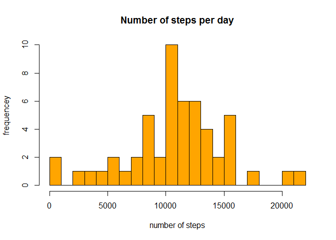
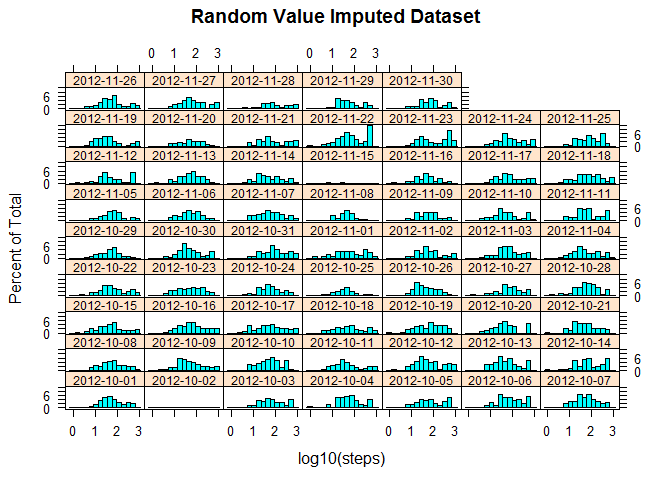

#  PA1_template.Rmd
pmp  
Thursday, November 13, 2014  

## REPRODUCIBLE RESEARCH - Peer Assessment Project 1
  

## Introduction

As stated in the introduction to this assignment, *[the] assignment makes use of data from a personal activity monitoring device. This device collects data at 5 minute intervals through out the day. The data consists of two months of data from an anonymous individual collected during the months of October and November, 2012 and include the number of steps taken in 5 minute intervals each day*.

## Loading & Processing Data  

The dataset for the assignment was supplied as a zipped file called *Activtiy monitoring data.zip* and the data stored in a variable named "activity".    


```r
## Data Loading
filename <- "./activity.csv"
activity <- read.csv(filename)
```

This project rises  4 questions regarding the activity dataset whose answers form the core of this report:  

* What is mean total number of steps taken per day?
* What is the average daily activity pattern?
* Missing values and the effect of imputing for missing values
* Are there differences in activity patterns between weekdays and weekends?


## Data Explaration  


```r
summary(activity)
```

```
##      steps                date          interval     
##  Min.   :  0.00   2012-10-01:  288   Min.   :   0.0  
##  1st Qu.:  0.00   2012-10-02:  288   1st Qu.: 588.8  
##  Median :  0.00   2012-10-03:  288   Median :1177.5  
##  Mean   : 37.38   2012-10-04:  288   Mean   :1177.5  
##  3rd Qu.: 12.00   2012-10-05:  288   3rd Qu.:1766.2  
##  Max.   :806.00   2012-10-06:  288   Max.   :2355.0  
##  NA's   :2304     (Other)   :15840
```

The dataset contains three variables representing:

.steps: Number of steps recorded in a 5-minute interval (missing values are coded as NA)


.date: The date on which the measurement was taken in YYYY-MM-DD format


.interval: Identifier for the 5-minute interval in which measurement was taken  


# Data Processing  

the following R libraries were necessary for this report  


```r
library (data.table)
```

```
## Warning: package 'data.table' was built under R version 3.1.2
```

```r
library( plyr)
```

```
## Warning: package 'plyr' was built under R version 3.1.2
```

```r
library(lattice)
library(ggplot2)
```

```
## Warning: package 'ggplot2' was built under R version 3.1.2
```

```r
library(grid)
library(gridExtra)
```

```
## Warning: package 'gridExtra' was built under R version 3.1.2
```


## Removing NA values
Histograms representing the distribution of number of steps per day, show a similar range in the frequency distribution values, as well as, in the number of steps per interval. 


```r
histogram(~steps|date, data=activity,layout=c(7,9), par.strip.text=list(cex=.75))
```

 

The differences among steps per day, however, are more apparent if the log base 10 of the number of steps perinterval are used:  


```r
histogram(~log10(steps)|date, data=activity,layout=c(7,9), par.strip.text=list(cex=.75))
```

 

One can notice very clearly that most of the missing data (NA values) corresponds not so much with isolated measurementa but with the absence of recorded measurments in nine of the 61 days monitored.

## Data set without missing values

```r
activity1 <- activity[complete.cases(activity),]
summary (activity1)
```

```
##      steps                date          interval     
##  Min.   :  0.00   2012-10-02:  288   Min.   :   0.0  
##  1st Qu.:  0.00   2012-10-03:  288   1st Qu.: 588.8  
##  Median :  0.00   2012-10-04:  288   Median :1177.5  
##  Mean   : 37.38   2012-10-05:  288   Mean   :1177.5  
##  3rd Qu.: 12.00   2012-10-06:  288   3rd Qu.:1766.2  
##  Max.   :806.00   2012-10-07:  288   Max.   :2355.0  
##                   (Other)   :13536
```
---
---

# Analysis and Data Query:
---

## What is the mean total number of steps taken per day?  

The mean and median values for the number of steps per day were calculated form the sum of steps for all intervals in a given day, its distribution of values shown below:

```r
steps.day <- aggregate(activity1$steps,by=list(activity1$date),sum)
mean.activity <- mean(steps.day$x)
median.activity <- median(steps.day$x)
hist(steps.day$x, breaks=30, col="orange", main = "Number of steps per day", xlab="number of steps", ylab="frequencey")
```

 

For comparison, the mean and median steps per interval, were also calculated

```r
mean.steps <- mean (activity1$steps,na.rm=TRUE)
sd.activity <- sd(steps.day$x)
median.steps <- median(activity1$steps,na.rm=TRUE)

df<- data.frame(mean.activity,sd.activity,median.activity,mean.steps,median.steps)
colnames(df) <-c("- mean per day","+/- sdev per day","- median per day", "- mean per interval", "-median per interval-")
```

as shown in the table below

```r
df
```

```
##   - mean per day +/- sdev per day - median per day - mean per interval
## 1       10766.19          4269.18            10765             37.3826
##   -median per interval-
## 1                     0
```
 


---

## What is the average daily activity pattern?  

A time series plot of the 5-minute interval (x-axis) and the average number of steps taken, averaged across all days (y-axis) shows the following pattern:  


```r
daily.activity <- aggregate(steps~interval, data=activity, mean)
daily.activity <- mutate(daily.activity, 
                interval=(interval/100))
                # interval=((interval/100)+100*(((interval/100)%%1)/60)))

x<- which.max(daily.activity$steps)
plot (daily.activity$interval, daily.activity$steps, type="l", 
      main =" daily activity",xlab="hours", ylab="average number of steps",
      xaxt='n')
axis(1,at = c(0,6,12,18,24))
```

 

With the 104th interval, corresponding to the 8:35am interval, showing the highest mean step activity from October to November 2012 for the given monitored individual


```r
daily.activity[x,]
```

```
##     interval    steps
## 104     8.35 206.1698
```

---  
---
#  Imputing missing values  

Imputation is a process used to generate values to replace NA missing values in a dataset.The total number of NA is relatively high at 2304 NAs

```r
number.na <- sum(is.na(activity$steps))
number.na
```

```
## [1] 2304
```

The use of imputation depends on the nature of the data [Missing data imputation](http://www.stat.columbia.edu/~gelman/arm/missing.pdf)]. As an example of the process, and how the methods used might or might not introduce changes in the general statistics of the data, I will use two imputation methods, one based on the mean and a second one based on a random sellection of values to replace missing values.The techniques are borrowed form [Thomas Leeper](http://thomasleeper.com/Rcourse/Tutorials/NAhandling.html).  


A new imputet dataset named "activity2" is based on mean value substitutions:


```r
activity2 <- activity
activity2$steps[is.na(activity2$steps)] <- mean (activity2$steps, na.rm=TRUE)
```

and a new dataset named "activity3" is based on random replacement imputation


```r
activity3 <- activity
samples <- activity3$steps[!is.na(activity3$steps)]
activity3$steps[is.na(activity3$steps)] <- sample(activity3$steps[!is.na(activity3$steps)],
                                            sum(is.na(activity3$steps)), TRUE)
```

### Comparisons of the two imputatation methods vs the original data 

First in terms of the distributions of the step numbers per interval per day:

```r
histogram(~log10(steps)|date, data=activity,layout=c(7,9), main="Original Dataset", par.strip.text=list(cex=.75))
```

 

```r
histogram(~log10(steps)|date, data=activity3,layout=c(7,9), main="Random Value Imputed Dataset", par.strip.text=list(cex=.75))
```

 
We can noticed that the random sellection values method (RSVM) fills in those days with missing data with similarly distributed frequency distributions as those observed for other days, suggesting that the RSV imputation method recreates the frequency distribution observed in the original data fearly well.  
The use of the mean value imputation, on the other hand, does alter the distribution patterns for those days with missing values but not the overall means:

```r
histogram(~log10(steps)|date, data=activity2,layout=c(7,9), main="Mean Imputed Dataset", par.strip.text=list(cex=.75))
```

 
---
Second, comparing the distributions of steps per day between the original data set and the RSV imputation is shown in the plot below:


```r
steps.day3 <- aggregate(activity3$steps,by=list(activity3$date),sum)

steps.day$method <- "none"
steps.day3$method <- "RVS imputed"

comparison <- rbind(steps.day,steps.day3)
ggplot(comparison, aes((x), fill=method)) + geom_density(alpha=.2)
```

 

The plot shows that, as would be expected, the total number of steps is higher in the RSV imputed data set compared to the original data set. As far as the RSV imputed data set being a valid correction of missing values is in part supported by the distributions being very similar between the two data sets, although the RSV imputation has smoothed the original distribution eliminating some of the dataset's no-random normal characteristics.

The R summary of the RSV imputed data set (activity3) is compared to the summary of the NA removed original data set (activity1)

```r
summary (activity1)
```

```
##      steps                date          interval     
##  Min.   :  0.00   2012-10-02:  288   Min.   :   0.0  
##  1st Qu.:  0.00   2012-10-03:  288   1st Qu.: 588.8  
##  Median :  0.00   2012-10-04:  288   Median :1177.5  
##  Mean   : 37.38   2012-10-05:  288   Mean   :1177.5  
##  3rd Qu.: 12.00   2012-10-06:  288   3rd Qu.:1766.2  
##  Max.   :806.00   2012-10-07:  288   Max.   :2355.0  
##                   (Other)   :13536
```

```r
summary (activity3)
```

```
##      steps                date          interval     
##  Min.   :  0.00   2012-10-01:  288   Min.   :   0.0  
##  1st Qu.:  0.00   2012-10-02:  288   1st Qu.: 588.8  
##  Median :  0.00   2012-10-03:  288   Median :1177.5  
##  Mean   : 37.03   2012-10-04:  288   Mean   :1177.5  
##  3rd Qu.: 12.00   2012-10-05:  288   3rd Qu.:1766.2  
##  Max.   :806.00   2012-10-06:  288   Max.   :2355.0  
##                   (Other)   :15840
```
 and the table below compares the mean +/- standrad deviation of dayly average steps between the imputed and original data set:

```r
mean.activity3 <- mean(steps.day3$x)
sd.activity3<- sd(steps.day3$x)
median.activity3 <- median(steps.day3$x)
df2<- data.frame(mean.activity,sd.activity,mean.activity3,sd.activity3)
colnames(df2) <-c("- mean per day","+/- sdev per day","- imputetd mean per day","+/- sdev per day -")
df2
```

```
##   - mean per day +/- sdev per day - imputetd mean per day
## 1       10766.19          4269.18                10665.38
##   +/- sdev per day -
## 1            4022.21
```

---
## Are there differences in activity patterns between weekdays and weekends?  

For the next query we are using the RVSM imputated data set for the analysis. 

Before embarking in the presumption that there is a differnce between weekday and weekend activies one needs to compare not only weekdays  versus weekends as a whole but each week day versus each other:  

```r
activity3$date <- as.POSIXlt(activity3$date)
activity3$day <-weekdays(as.Date(activity3$date))
activity3$day <- factor(activity3$day, levels= c("Monday", 
                "Tuesday", "Wednesday", "Thursday", "Friday", "Saturday", "Sunday"))

weekly.steps <- by(activity3$steps, as.factor(activity3$day), mean)
```

The resulting plot  bellow indicates that steps per five minute interval increases in the weekends and in the middle of the week. Without knowing the particular activities of the inividual monitored, the elevated average number of steps per interval on a Wednesday could also be due to an increased stepping tempo. It is also evident that the "weekend" trend starts on Friday, a day that needs to be included as part of the weekend:


```r
plot(weekly.steps, main = "Number of steps by day of the week", 
     ylab="mean number of steps", xlab="day of the week", type='l', xaxt='n', cex=0.85)
axis(1, at = 1:7, labels=c("Monday","Tuesday", "Wednesday", "Thursday", "Friday", "Saturday", "Sunday"), cex.axis=0.75)
abline(h=mean(weekly.steps), col=3, lty=2)
```

 

A better insight of the average weekly 24 hour activity pattern is shown in the next plot generated comparing the average day of the week 24 hour activity. 

### Day of the week datasets:

```r
Monday.steps <- subset( activity, activity3$day =="Monday")
Monday.activity <- aggregate(steps~interval, data=Monday.steps, mean)
Monday.activity <- mutate(Monday.activity,interval=(interval/100))

Tuesday.steps <- subset( activity, activity3$day =="Tuesday")
Tuesday.activity <- aggregate(steps~interval, data=Tuesday.steps, mean)
Tuesday.activity <- mutate(Tuesday.activity,interval=(interval/100))

Wednesday.steps <- subset( activity, activity3$day =="Wednesday")
Wednesday.activity <- aggregate(steps~interval, data=Wednesday.steps, mean)
Wednesday.activity <- mutate(Wednesday.activity,interval=(interval/100))

Thursday.steps <- subset( activity, activity3$day =="Thursday")
Thursday.activity <- aggregate(steps~interval, data=Thursday.steps, mean)
Thursday.activity <- mutate(Thursday.activity,interval=(interval/100))

Friday.steps <- subset( activity, activity3$day =="Friday")
Friday.activity <- aggregate(steps~interval, data=Friday.steps, mean)
Friday.activity <- mutate(Friday.activity,interval=(interval/100))

Saturday.steps <- subset( activity, activity3$day =="Saturday")
Saturday.activity <- aggregate(steps~interval, data=Saturday.steps, mean)
Saturday.activity <- mutate(Saturday.activity,interval=(interval/100))

Sunday.steps <- subset( activity, activity3$day =="Sunday")
Sunday.activity <- aggregate(steps~interval, data=Sunday.steps, mean)
Sunday.activity <- mutate(Sunday.activity,interval=(interval/100))
```


###  Plot of Day of the Week activities
Orange corresponds to the standard weekdays (Monday through Thursday) and blue corresponds to the weekend days (Friday through Sunday). The y scale is fixed between 0 and 350 steps. 


```r
plot.new()

par (mar=c(1,1,1,1))
par(mfrow = c(5, 2), cex=.5)

plot (Monday.activity$interval, Monday.activity$steps, type="l", ylim=c(0,350), col="orange",
      main =" Monday activity",xlab="hours", ylab="average number of steps",
      xaxt='n')
axis(1,at = c(0,6,12,18,24))
plot (Friday.activity$interval, Friday.activity$steps, type="l", ylim=c(0,350), col="blue",
      main =" Friday activity",xlab="hours", ylab="average number of steps",
      xaxt='n') 
axis(1,at = c(0,6,12,18,24))
plot (Tuesday.activity$interval, Tuesday.activity$steps, type="l", ylim=c(0,350),col="orange",
      main ="Tuesday activity",xlab="hours", ylab="average number of steps",
      xaxt='n')
axis(1,at = c(0,6,12,18,24))
plot (Saturday.activity$interval, Saturday.activity$steps, type="l", ylim=c(0,350), col="blue",
      main =" Saturday activity",xlab="hours", ylab="average number of steps",
      xaxt='n')
axis(1,at = c(0,6,12,18,24))
plot (Wednesday.activity$interval, Wednesday.activity$steps, type="l", ylim=c(0,350),col="orange",
      main ="Wednesday activity",xlab="hours", ylab="average number of steps",
      xaxt='n')
axis(1,at = c(0,6,12,18,24))
plot (Sunday.activity$interval, Sunday.activity$steps, type="l", ylim=c(0,350), col="blue",
      main =" Sunday activity",xlab="hours", ylab="average number of steps",
      xaxt='n')
axis(1,at = c(0,6,12,18,24))
plot (Thursday.activity$interval, Thursday.activity$steps, type="l", ylim=c(0,350),col="orange",
      main ="Thursday activity",xlab="hours", ylab="average number of steps",
      xaxt='n')
axis(1,at = c(0,6,12,18,24))
```

 
Three main patterns are evident from the data:
-  Somewhere between 8am and 9am this individum performed the longest consecutive walk/run except for Sunday
-  Thursday is the day with the least number of steps but with two consectuive long walks/runs 
-  The weekend days have the highest overal daily activity.

### Are the differences between Weekdays and Weekend activity significant?


```r
selection <- c("Monday","Tuesday","Thursday")
Weekday.steps <- subset( activity, activity3$day == selection)
Weekday.mean.steps <- aggregate(Weekday.steps$steps,by=list(Weekday.steps$date),sum)
mean.weekday <- mean(Weekday.steps$steps, na.rm=TRUE)

mean.Weekday.day <- mean(aggregate(Weekday.steps$steps,by=list(Weekday.steps$date),sum)$x, na.rm=TRUE)
sd.Weekday.day <- sd(aggregate(Weekday.steps$steps,by=list(Weekday.steps$date),sum)$x, na.rm=TRUE)

selection2 <- c("Friday","Saturday","Sunday")
Weekend.steps <- subset( activity, activity3$day == selection2)
Weekend.mean.steps <- aggregate(Weekend.steps$steps,by=list(Weekend.steps$date),sum)
mean.weekend <- mean(Weekend.steps$steps, na.rm=TRUE)

mean.Weekend.day <- mean(aggregate(Weekend.steps$steps,by=list(Weekend.steps$date),sum)$x, na.rm=TRUE)
sd.Weekend.day <- sd(aggregate(Weekend.steps$steps,by=list(Weekend.steps$date),sum)$x, na.rm=TRUE)
```

The next plot compares the average daily values for the weekdays vs the weekends. One can see a definite increase in the mean of the values, as well as, a bias towards larges numbers of steps during the weekend:


```r
p1<- qplot(Group.1, x, data=Weekday.mean.steps, geom="boxplot", ylim=c(0,7000), alpha=.5, main="weekdays" )
p1 <- p1 + theme(axis.title.x=element_blank()) + geom_hline(aes(yintercept=mean.Weekday.day))

p2 <-qplot(Group.1, x, data=Weekend.mean.steps, geom="boxplot", ylim=c(0,7000), alpha=.5, main="weekend" )
p2 <- p2 + theme(axis.title.x=element_blank()) + geom_hline(aes(yintercept=mean.Weekend.day))
grid.arrange(p1,p2,ncol=2,main="comparison between weekdays and weekend log10 of steps")
```

```
## Warning: Removed 3 rows containing non-finite values (stat_boxplot).
```

```
## Warning: Removed 4 rows containing non-finite values (stat_boxplot).
```

 

Both the mean per interval number of steps and the mean per daily steps is increased during the weekend. "Speedy Gonzales on the weekends!"

```r
df3<- data.frame(mean.weekday,mean.weekend)
colnames(df3) <-c("- mean per interval per weekday","- mean per interval per weekend -")
df3
```

```
##   - mean per interval per weekday - mean per interval per weekend -
## 1                         31.5178                          42.78819
```

```r
df4<- data.frame(mean.Weekday.day,sd.Weekday.day,mean.Weekend.day,sd.Weekend.day)
colnames(df4) <-c("- mean per day per weekday"," +/- SD","- mean per day per weekend"," +/- SD -")
df4
```

```
##   - mean per day per weekday   +/- SD - mean per day per weekend  +/- SD -
## 1                   3025.708 1636.366                   4107.667  1256.119
```

---
---

### END
 
